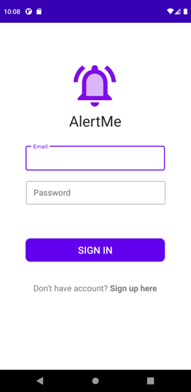
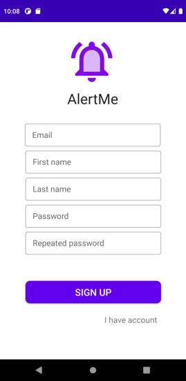
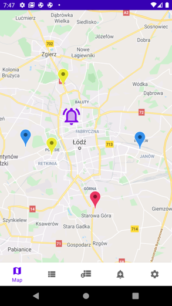
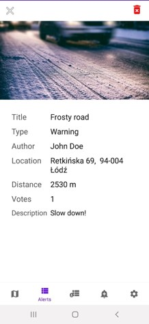
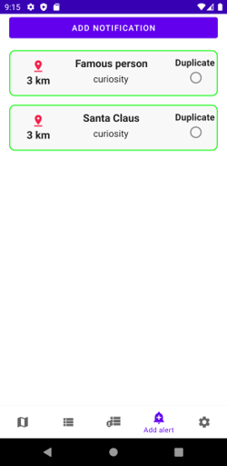
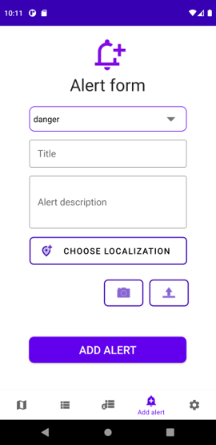
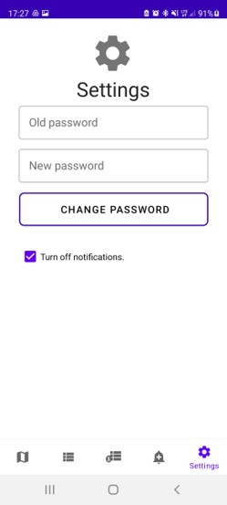

# AlertMeApp

Android app for adding and displaying threats in your area. Application consists of server side and fron side implementation. Here only frontend will be presented. Project realised in a lab group for mobile developement module.

## Tech Stack

`Spring Boot`

`PostgreSQL`

`FireBase`

`Android`

## Login

Above we can see login and register screens. All of the fields are validated on client and server side. As a logged user we will have a possiblity to create new notifications.

## Functionality

Map is a main screen. Over there we can see pins, which indicate some notification. The bell icon means clusterization - if we zoom in, we will be able to see separated pins over this area. After clicking on any pin, we will be redirected to details view of the notification, which provides as many information about it.

We can also check what's going on around as in a form of list of notifications. We can also add our own form by providing data like - type,title, description, photo and localization.

Application has also a functionality changing the password in the settings. Additional feautre is turning on or off the incoming notifications about our area.